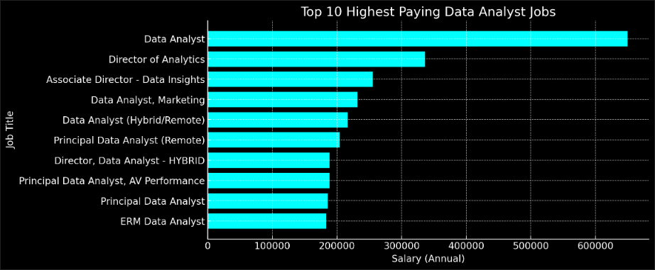
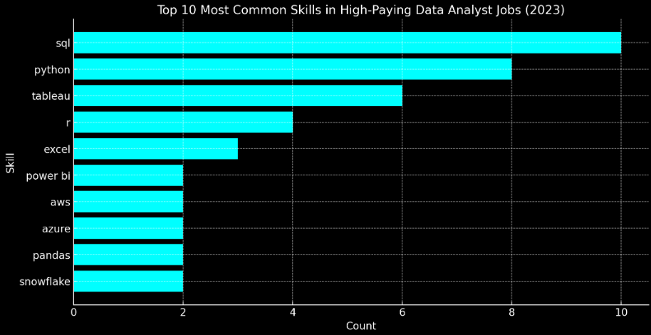

# Introduction

This project provides an analysis of the data job market, with a particular focus on data analyst roles. It examines key factors such as top-paying positions, essential skills, and the relationship between job demand and salary trends in the field of data analytics.

The SQL queries used in this analysis are available here: [project_sql folder](/project_sql/) 

# Background

This job market analysis is based on a course led by respected Data Analyst Luke Barrouse. The capstone project, presented here, explores the data analyst job market using the tools and techniques covered in the course. The raw data used for this analysis can be accessed through the following link: [SQL Course](https://www.lukebarousse.com/sql).

###  The objective of my SQL queries was to address the following questions:
1. What are the top-paying data analyst jobs?
2. What skills are required for these top-paying jobs?
3. What skills are most in demand for data analysts?
4. Which skills are associated with higher salaries?
5. What are the most optimal skills to learn?

# Tools I Used

The tools I used to be able to analyze the data analyst job market are the following:
- **SQL**: For querying the database effectively to generate valuable insights
- **PostgreSQL**: Used as the database management system
- **Microsoft Visual Studio Code**: Executed SQL queries and handled database management
- **Git and GitHub**: Facilitated project tracking to enable version control and sharing of SQL scripts and observations

# Analysis

### 1. Top Paying Data Analyst Jobs

To determine the most well-compensated roles, I analyzed data analyst positions based on average annual salary and location, prioritizing remote opportunities. 

``` sql
SELECT 
    job_id,
    job_title,
    salary_year_avg,
    name AS company_name
FROM
    job_postings_fact AS job_postings
LEFT JOIN company_dim ON job_postings.company_id = company_dim.company_id
WHERE
    job_title_short = 'Data Analyst' AND
    job_location = 'Anywhere' AND
    salary_year_avg IS NOT NULL
ORDER BY    
    salary_year_avg DESC
LIMIT 10
```
Insights from the top 10 data analyst jobs in 2023:
- **Industry Influence**: The tech, finance, and healthcare sectors offer the highest salaries, as they rely on big data, AI, and predictive analytics. Companies like Meta, SmartAsset, and UCLA Health demonstrate strong demand for data expertise.
- **Wide Salary Range**: Compensation varies from $184,000 to an outlier of $650,000, influenced by role complexity, specialization, and company size. Leadership and high-impact roles (e.g., Director of Analytics at Meta - $336,500) offer significantly higher pay.
- **Leadership and Experience**: Senior positions consistently command top salaries, emphasizing the value of decision-making, management, and strategic insights. However, specialists in AI, cloud computing, and business intelligence can still earn six figures without moving into leadership.



### 2. Skills for Top Paying Jobs

To identify the skills needed for top-paying jobs, I combined job postings with skills data, revealing key insights into what employers prioritize for high-compensation roles.

```sql
WITH top_paying_jobs AS (
SELECT 
    job_id,
    job_title,
    salary_year_avg,
    name AS company_name
FROM
    job_postings_fact AS job_postings
LEFT JOIN company_dim ON job_postings.company_id = company_dim.company_id
WHERE
    job_title_short = 'Data Analyst' AND
    job_location = 'Anywhere' AND
    salary_year_avg IS NOT NULL
ORDER BY    
    salary_year_avg DESC
LIMIT 10
)

SELECT 
    top_paying_jobs.*,
    skills
FROM top_paying_jobs
INNER JOIN skills_job_dim ON top_paying_jobs.job_id = skills_job_dim.job_id
INNER JOIN skills_dim ON skills_job_dim.skill_id = skills_dim.skill_id
ORDER BY 
    salary_year_avg DESC
```

Insights of the most demanded skills for the top 10 highest paying data analyst jobs in 2023:
- SQL and Python dominate, reinforcing their importance in data analyst roles.
- Tableau and Excel indicate a strong demand for visualization and reporting skills.
- R, Pandas, and Snowflake suggest a mix of statistical analysis and cloud-based data management.
- Azure and Bitbucket show that cloud platforms and version control are also valuable.



### 3. In-Demand Skills for Data Analysts

This query revealed the most in-demand skills in job postings for remote work arrangements, highlighting key areas of focus.

```sql
SELECT 
    skills_dim.skills,
    COUNT(skills_job_dim.job_id) AS demand_count
FROM 
    job_postings_fact
INNER JOIN skills_job_dim ON job_postings_fact.job_id = skills_job_dim.job_id
INNER JOIN skills_dim ON skills_job_dim.skill_id = skills_dim.skill_id
WHERE
    job_title_short = 'Data Analyst' AND
    job_work_from_home = True
GROUP BY 
   skills_dim.skills
ORDER BY
    demand_count DESC
LIMIT 5;
```
The most in-demand skills for data analysts are SQL, Excel, Python, Tableau, and Power BI. SQL tops the list, highlighting its importance in data management and querying. Excel remains essential for analysis and reporting, while Python is valued for automation and statistical analysis. Tableau and Power BI emphasize the need for strong data visualization skills. A combination of these technical skills can greatly enhance career opportunities in data analytics.

| Skills   | Demand Count |
|----------|-------------|
| SQL      | 7,291       |
| Excel    | 4,611       |
| Python   | 4,330       |
| Tableau  | 3,745       |
| Power BI | 2,609       |


### 4. Skills Based on Salary

Analyzing salary trends across various skills helped identify the ones that offer the highest earning potential.

```sql
SELECT 
    skills_dim.skills,
    ROUND(AVG(salary_year_avg), 2) AS avg_salary
FROM 
    job_postings_fact
INNER JOIN skills_job_dim ON job_postings_fact.job_id = skills_job_dim.job_id
INNER JOIN skills_dim ON skills_job_dim.skill_id = skills_dim.skill_id
WHERE
    job_title_short = 'Data Analyst'
    AND salary_year_avg IS NOT NULL
    AND job_work_from_home = True
GROUP BY 
   skills_dim.skills
ORDER BY
    avg_salary DESC
LIMIT 30;
```
Insights about the top paying skills for Data Analysts:
- **Big Data & AI-related skills offer the highest salaries.** PySpark, DataRobot, and Watson dominate high-paying roles.
- **Cloud computing and DevOps tools are becoming essential for data analysts.** Kubernetes, GCP, and Bitbucket are valuable additions.
- **Finance, healthcare, and technology industries are driving the highest-paying roles.** Business intelligence, AI-driven insights, and automation are in demand.

| Skills         | Average Salary ($) |
|---------------|-------------------|
| PySpark       | 208,172           |
| Bitbucket     | 189,155           |
| Couchbase     | 160,515           |
| Watson        | 160,515           |
| DataRobot     | 155,486           |
| GitLab        | 154,500           |
| Swift         | 153,750           |
| Jupyter       | 152,777           |
| Pandas        | 151,821           |
| Elasticsearch | 145,000           |


### 5. Most Optimal Skills to Learn

This analysis combined salary trends and demand data to identify skills that are both high-paying and highly sought after, providing a strategic roadmap for professional growth.

```sql
SELECT 
    skills_dim.skill_id,
    skills_dim.skills,
    COUNT(skills_job_dim.job_id) AS demand_count,
    ROUND(AVG(job_postings_fact.salary_year_avg), 0) AS avg_salary
FROM job_postings_fact
INNER JOIN skills_job_dim ON job_postings_fact.job_id = skills_job_dim.job_id
INNER JOIN skills_dim ON skills_job_dim.skill_id = skills_dim.skill_id
WHERE
    job_title_short = 'Data Analyst'
    AND salary_year_avg IS NOT NULL
    AND job_work_from_home = True 
GROUP BY
    skills_dim.skill_id
HAVING
    COUNT(skills_job_dim.job_id) > 10
ORDER BY
    avg_salary DESC,
    demand_count DESC
LIMIT 30;
```
Insights about the most optimal skills to learn for Data Analysts that is high in demand and offers a high salary:

- **High-demand, moderate-pay skills:** SQL, Python, Tableau, and Power BI are widely sought after but offer moderate salaries.
- **High-paying, niche skills:** Go, Confluence, Hadoop, and cloud platforms like Snowflake and Azure provide strong salaries despite lower demand.
- **Cloud & Big Data:** AWS, Azure, BigQuery, Snowflake, Redshift, Hadoop, and Spark highlight the industry's focus on cloud and data scalability.
- **BI & Analytics Tools:** Looker, SAS, and Qlik remain relevant for business intelligence roles.
- **Programming & Database:** SQL, Python, R, and Java are essential but earn less than specialized cloud and big data skills.

| Skill ID | Skills      | Demand Count | Average Salary ($) |
|----------|------------|--------------|--------------------|
| 8        | Go         | 27           | 115,320           |
| 234      | Confluence | 11           | 114,210           |
| 97       | Hadoop     | 22           | 113,193           |
| 80       | Snowflake  | 37           | 112,948           |
| 74       | Azure      | 34           | 111,225           |
| 77       | BigQuery   | 13           | 109,654           |
| 76       | AWS        | 32           | 108,317           |
| 4        | Java       | 17           | 106,906           |
| 194      | SSIS       | 12           | 106,683           |
| 233      | Jira       | 20           | 104,918           |


# What I Learned
Throughout this course, I have significantly improved my SQL skills, allowing me to work more efficiently with databases and extract meaningful insights from data. Here are the key areas where I have developed expertise:

- **Complex Query Crafting:** Learned to write advanced SQL queries which enabled me to retrieve and manipulate data from complex relational databases with greater accuracy and efficiency.

- **Data Aggregation** – Significant improvement in SQL aggregation functions, allowing me to summarize large datasets effectively. Enabled me to analyze trends, calculate key metrics, and derive actionable insights from raw data.

- **Analytical Skills:** SQL has strengthened my ability to think critically and solve data-related problems. I can now perform exploratory data analysis, identify patterns, and generate reports that support data-driven decision-making.

# Conclusions

Based on the analysis, these following conclusions were made:

1. **Top-Paying Data Analyst Jobs:** Tech, finance, and healthcare industries offer the highest salaries, ranging from $184,000 to $650,000, with leadership and specialized roles earning the most.

2. **Skills for High-Paying Roles:** – SQL, Python, Tableau, and cloud-based tools (Snowflake, Azure) are essential for top salaries, reflecting demand for data management, analytics, and automation.

3. **Most In-Demand Skills:** SQL, Excel, Python, Tableau, and Power BI are the most frequently requested skills in job postings, balancing traditional data tools with modern analytics needs.

4. **Skills That Lead to Higher Salaries:** AI, big data, and cloud computing skills (PySpark, DataRobot, Kubernetes) command the highest salaries, especially in finance and healthcare analytics.

5. **Best Skills to Learn:** SQL, Python, and Tableau offer high demand and steady salaries, while cloud and big data tools (Snowflake, Hadoop) provide niche high-pay opportunities.

A well-rounded skill set, combining fundamental data analysis tools with advanced AI, cloud, and big data expertise, is key to unlocking the highest salaries and maximizing career opportunities in data analytics.


